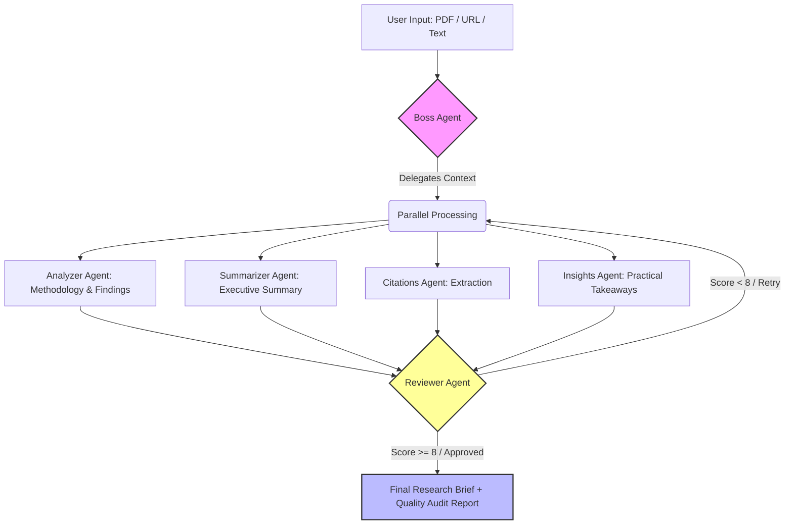

Bhai, abhi **7:17 PM** ho chuke hain, deadline mein mushkil se **4.5 ghante** bache hain. Tumhara folder structure ekdum solid hai, ab is README ko seedha copy karo aur apne GitHub ke root folder (`research_agent/`) mein `README.md` ke naam se paste kar do. 

Maine isme **Mermaid.js** ka flow diagram daal diya hai jo GitHub par automatically ek mast visual flowchart ban jayega. Ye ekdum "Production-Ready" aur Vilambo ke evaluation criteria ke hisab se optimized hai.

---

### **Copy This Code Block Below:**

```markdown
# 🧠 Research Swarm AI

An AI-powered multi-agent research paper analyzer built with LangGraph and FastAPI for automated deep analysis, summarization, and citation extraction.

**🔗 [Watch the 3-Minute Demo Video Here] (Insert your Google Drive/YouTube link here)**

## 🚀 Architecture & Workflow

This system utilizes a hierarchical multi-agent architecture powered by LangGraph. A Boss Agent delegates tasks to specialized sub-agents, and a Reviewer Agent ensures output quality before final delivery.



## ✨ Key Features

* **Multi-Agent Orchestration:** Powered by LangGraph for seamless delegation and parallel processing.
* **Iterative Quality Control:** Built-in Reviewer Agent evaluates sub-agent outputs on a 1-10 scale and triggers retries if quality standards are not met.
* **Flexible Inputs:** Robust parsing system that accepts direct PDF file uploads, research URLs, or raw text.
* **Production-Grade Full-Stack:** FastAPI backend coupled with a modern React/Vite frontend for a seamless user experience.

## 🛠️ Tech Stack

* **Backend:** FastAPI, Python 3.9+
* **AI/LLM:** LangGraph, LangChain, Groq API (Llama 3)
* **Frontend:** React, Vite, Tailwind CSS
* **Vector Store:** ChromaDB / HuggingFace Embeddings

## ⚙️ Setup & Installation

### 1. Clone the Repository
```bash
git clone [https://github.com/YOUR_USERNAME/research-swarm-ai.git](https://github.com/YOUR_USERNAME/research-swarm-ai.git)
cd research-swarm-ai
```

### 2. Backend Setup
Navigate to the backend directory and install dependencies:
```bash
cd BACKEND
pip install -r requirements.txt
```

Create a `.env` file in the `BACKEND` root directory (Do NOT commit this file):
```env
GROQ_API_KEY=your_groq_api_key_here
```

Start the FastAPI server:
```bash
uvicorn main:app --reload --host 0.0.0.0 --port 8000
```

### 3. Frontend Setup
Open a new terminal, navigate to the frontend directory, and start the Vite development server:
```bash
cd FRONTEND
npm install  # or yarn install
npm run dev  # or yarn dev
```

## 📝 Assignment Deliverables Addressed

1. **System Prompt Design:** Highly specialized prompts for 5 distinct agents.
2. **Review & Iteration:** Implemented state-managed retry loops via LangGraph.
3. **Information Extraction:** Accurate metadata, methodology, and citation parsing.
4. **Structured Output:** Strict JSON/Markdown enforcement for the final Research Brief.
```

---

### **⚠️ Last Minute Pro-Tips:**
1. **Demo Video Link:** README ke top par maine ek placeholder lagaya hai `[Watch the 3-Minute Demo Video Here]`. Apni Google Drive ka **Public** link wahan zaroori daal dena warna marks kat jayenge.
2. **Mermaid Diagram:** GitHub is code block ko apne aap ek sundar diagram mein convert kar dega, tumhe alag se koi image dalne ki zaroorat nahi hai.

Bhai, repo ekdum ready hai! Ab bas tumhe apni **3-minute demo video** record karni hai. 

**Kya main tumhe us video ke liye ek "cut-to-cut" 3-minute ka script/outline likh kar doon, taaki tum video banate waqt sirf unhi points par focus karo jisse maximum marks milenge?**
